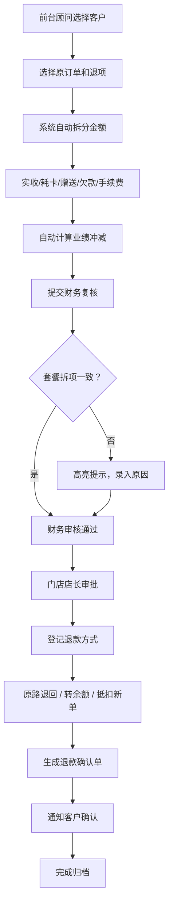

# 医美机构退款退项核算工作台 - 产品需求文档 (PRD)

## 1. 产品概述

医美机构退款退项核算 Web 工作台，为连锁医美门诊提供标准化的退费核算流程管理系统。系统面向财务主管和门店店长，实现从退款申请、项目核销、业绩冲减、多级审批到到账登记的全流程闭环管理，减少人工核算错误和跨门店数据扯皮问题。

- **核心价值**：自动化金额拆分、标准化审批流程、可视化业绩追溯、无纸化凭证管理
- **目标用户**：财务主管、门店店长、前台顾问、咨询师
- **应用场景**：每日退费核算、跨门店结算、月度业绩冲减对账、客户退款确认

---

## 2. 核心功能

### 2.1 用户角色

| 角色 | 说明 | 核心权限 |
|------|------|----------|
| 前台顾问 | 门店前台操作人员 | 创建退款申请、选择客户/订单、录入核销信息、提交审批 |
| 财务主管 | 总部财务人员 | 复核核算明细、审核业绩冲减、导出凭证、查看全部门店报表 |
| 门店店长 | 单店管理者 | 审批本门店申请、登记到账、查看门店汇总报表 |
| 咨询师 | 业绩关联人员 | 查看个人业绩冲减记录、确认退款明细 |

### 2.2 功能模块

1. **申请列表**：退款申请总览、多维度筛选、快速检索、状态标签、新建申请入口
2. **核算详情**：项目核销、金额自动拆分（实收/耗卡/赠送/欠款/手续费）、业绩冲减计算、差异提醒、套餐拆项校验
3. **审批中心**：待办审批、已办审批、审批流程图、多级审批意见、退回重填
4. **报表看板**：门店汇总统计、顾问业绩追踪、趋势图表、月度对比、异常预警
5. **客户档案**：客户基本信息、历史订单、退款记录、通知发送、退款确认单
6. **系统设置**：审批流配置、凭证模板、手续费规则、操作日志、权限管理

### 2.3 页面详情

| 页面名称 | 模块名称 | 功能描述 |
|----------|----------|----------|
| 申请列表 | 顶部筛选栏 | 按门店、状态、日期、客户、顾问筛选；搜索框 |
| 申请列表 | 统计卡片 | 待审批、今日退款、本月累计、异常单数 |
| 申请列表 | 数据表格 | 申请单号、客户、门店、金额、状态、申请时间、操作列 |
| 申请列表 | 新建申请 | 弹窗选择客户→选择原订单→录入申请信息 |
| 核算详情 | 客户信息卡片 | 头像、姓名、电话、会员等级、历史退款次数 |
| 核算详情 | 原订单信息 | 订单号、下单时间、总金额、支付方式 |
| 核算详情 | 项目核销表 | 项目名称、原价、已做次数、剩余次数、本次退项、耗卡金额、赠送金额 |
| 核算详情 | 金额拆分面板 | 实收金额、耗卡抵扣、赠送抵扣、欠款抵扣、手续费、实退金额自动计算 |
| 核算详情 | 业绩冲减表 | 医生/咨询师/渠道姓名、原业绩、冲减金额、冲减后业绩 |
| 核算详情 | 差异提醒区 | 套餐拆项金额不一致高亮、原因录入框 |
| 核算详情 | 操作栏 | 保存草稿、提交财务复核、打印确认单 |
| 审批中心 | 待办/已办标签 | Tab 切换视图 |
| 审批中心 | 审批列表 | 申请单号、申请人、提交时间、金额、当前节点 |
| 审批中心 | 审批详情抽屉 | 完整核算信息、流程图、审批意见框、同意/退回按钮 |
| 报表看板 | 时间范围选择 | 今日/本周/本月/本季/自定义 |
| 报表看板 | KPI 卡片 | 退款总额、退款单数、平均退款、冲减业绩总额 |
| 报表看板 | 门店汇总图表 | 柱状图对比各门店退款金额/单数 |
| 报表看板 | 顾问排行榜 | 顾问业绩冲减排名表 |
| 报表看板 | 趋势折线图 | 近 30 天退款趋势 |
| 客户档案 | 客户搜索 | 姓名/手机号/会员号搜索 |
| 客户档案 | 客户信息卡片 | 头像、基本信息、会员标签 |
| 客户档案 | 订单历史 | 订单列表、关联退款记录 |
| 客户档案 | 退款记录时间线 | 每次退款详情、状态时间线 |
| 客户档案 | 通知发送 | 短信/站内信模板选择、一键发送确认单 |
| 设置 | 审批流配置 | 节点配置、审批人设置、条件分支 |
| 设置 | 凭证模板 | 退款确认单模板编辑、字段映射 |
| 设置 | 手续费规则 | 按支付方式配置手续费比例 |
| 设置 | 操作日志 | 全系统操作留痕、按人/时间筛选 |
| 设置 | 权限管理 | 角色权限配置、用户管理 |

---

## 3. 核心流程

### 3.1 退款申请到到账登记流程

前台顾问创建退款申请 → 系统自动拆分金额并核算 → 提交财务复核 → 财务校验业绩冲减 → 发现差异提示录入原因 → 财务复核通过 → 门店店长审批 → 登记退款方式（原路退回/转余额/抵扣新单）→ 生成退款确认单 → 通知客户确认 → 完成归档

### 3.2 金额拆分计算逻辑

- 项目退项金额 = 项目单价 × 剩余次数（退项）
- 实收部分 = 项目退项金额 × (实收金额 / 订单总金额)
- 耗卡抵扣 = 项目退项金额 × (耗卡金额 / 订单总金额)
- 赠送抵扣 = 项目退项金额 × (赠送金额 / 订单总金额)
- 手续费 = 实收部分 × 手续费率
- 实退金额 = 实收部分 - 手续费

---

## 4. 用户界面设计

### 4.1 设计风格

- **整体风格**：专业财务系统风格，稳重、清晰、高信息密度，兼顾医疗行业的洁净感
- **主色调**：深海蓝 `#1e3a5f`（专业可信）+ 医用青 `#0d9488`（医疗属性）
- **辅助色**：警示红 `#dc2626`（异常提醒）、成功绿 `#16a34a`（通过）、警示橙 `#ea580c`（待办）
- **背景色系**：浅灰 `#f8fafc` 为主背景，白色卡片配细灰边框
- **按钮风格**：圆角 6px，主按钮采用蓝底白字，次要按钮白底灰边配灰字，危险按钮红底白字
- **字体**：中文使用 `PingFang SC` / `Microsoft YaHei`，数字使用 `Roboto Mono` 等宽字体突出金额
- **布局风格**：左侧固定导航栏 + 顶部面包屑 + 右侧主内容区，采用卡片式模块化布局
- **图标风格**：统一使用 Lucide 线性图标，大小 16-20px

### 4.2 页面设计概览

| 页面名称 | 模块名称 | UI 元素与风格 |
|----------|----------|---------------|
| 申请列表 | 统计卡片 | 四色渐变卡片（蓝/橙/绿/红）+ 大数字 + 趋势小箭头 |
| 申请列表 | 数据表格 | 斑马纹表格、状态标签（Badge）、行悬停高亮、操作按钮组 |
| 核算详情 | 金额拆分面板 | 等宽字体金额展示、公式分步计算、差异项红色虚线边框 |
| 核算详情 | 业绩冲减表 | 每行带冲减前后对比、差额用红色括号显示 |
| 审批中心 | 审批流程图 | 横向时间轴、当前节点高亮闪烁、已完成节点打勾 |
| 报表看板 | 图表区域 | 柱状图+折线图组合、渐变填充、支持数据点悬浮详情 |
| 报表看板 | 排行榜 | 前三名带金银铜奖杯图标、渐变背景条 |
| 客户档案 | 时间线 | 竖线时间轴、节点圆点、操作记录卡片 |
| 设置 | 权限矩阵 | 交叉表格、Checkbox 矩阵配置 |

### 4.3 响应式设计

- **设计优先**：Desktop-first，优化 1440×900 及以上分辨率
- **侧边栏**：< 1024px 收起为汉堡菜单
- **数据表格**：< 768px 切换为卡片列表视图，隐藏次要列
- **图表**：移动端自适应宽度，简化坐标轴标签

### 4.4 交互细节

- 页面加载：骨架屏 `animate-pulse` 过渡
- 表格行：`hover:bg-slate-50` + 左侧 3px 蓝色竖线高亮
- 按钮：`transition-all duration-200`，悬停时轻微上浮 + 阴影加深
- 差异提醒：红色脉冲动画 `animate-pulse` 边框，强制用户输入原因后才可提交
- 审批通过：绿色勾选图标旋转出现动画
- 金额数字：超过 6 位数自动千分位分隔
