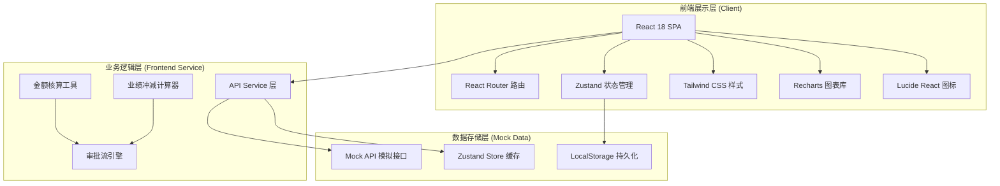
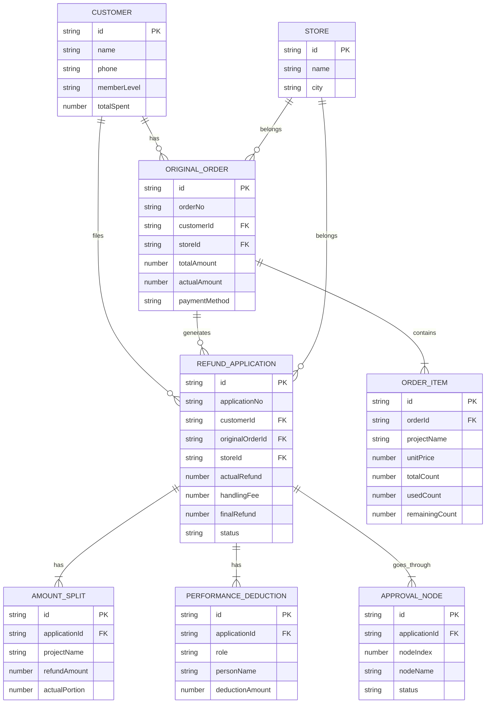

# 医美机构退款退项核算工作台 - 技术架构文档

## 1. 架构设计



## 2. 技术选型说明

- **前端框架**：React 18 + TypeScript 5 — 类型安全的组件化开发，适合复杂表单和计算逻辑
- **构建工具**：Vite 5 — 极速开发体验，HMR 热更新
- **样式方案**：Tailwind CSS 3 + PostCSS — 原子化 CSS，高效构建设计系统
- **路由管理**：React Router DOM 6 — 声明式路由，支持嵌套路由
- **状态管理**：Zustand 4 — 轻量状态管理，DevTools 支持，比 Redux 更简洁
- **图表可视化**：Recharts 2 — React 原生图表库，支持柱状图、折线图、饼图
- **图标库**：Lucide React — 轻量 SVG 图标，统一设计语言
- **日期处理**：Day.js — 轻量日期工具库
- **后端模拟**：MSW (Mock Service Worker) / 自定义 Mock 层 — 前端独立开发，无需真实后端
- **代码规范**：ESLint + Prettier — 统一代码风格

## 3. 路由定义

| 路由路径 | 页面名称 | 说明 |
|----------|----------|------|
| `/` | 申请列表 | 首页，默认跳转申请列表 |
| `/applications` | 申请列表 | 退款申请总览、筛选、搜索 |
| `/applications/:id` | 核算详情 | 单个申请的核算详情、金额拆分、业绩冲减 |
| `/applications/new` | 新建申请 | 创建退款申请（多步表单） |
| `/approvals` | 审批中心 | 待办/已办审批、审批操作 |
| `/reports` | 报表看板 | 门店汇总、顾问追踪、数据可视化 |
| `/customers` | 客户档案 | 客户列表、搜索 |
| `/customers/:id` | 客户详情 | 单个客户档案、订单/退款记录 |
| `/settings` | 设置 | 审批流、凭证模板、手续费规则 |
| `/settings/audit-log` | 操作日志 | 全系统操作留痕 |
| `*` | 404 页面 | 未找到页面 |

## 4. 核心数据类型定义

```typescript
// 客户信息
interface Customer {
  id: string;
  name: string;
  phone: string;
  avatar?: string;
  memberLevel: '普通' | '银卡' | '金卡' | '钻石';
  totalSpent: number;
  refundCount: number;
  createdAt: string;
}

// 订单项目
interface OrderItem {
  id: string;
  orderId: string;
  projectName: string;
  unitPrice: number;
  totalCount: number;      // 总次数
  usedCount: number;       // 已做次数
  remainingCount: number;  // 剩余次数
  refundCount: number;     // 本次退项次数
  type: 'normal' | 'gift' | 'package';
  packageId?: string;
}

// 原订单
interface OriginalOrder {
  id: string;
  orderNo: string;
  customerId: string;
  storeId: string;
  totalAmount: number;      // 订单总金额
  actualAmount: number;     // 实收金额
  cardDeduction: number;    // 耗卡金额
  giftAmount: number;       // 赠送金额
  debtAmount: number;       // 欠款金额
  paymentMethod: '微信' | '支付宝' | '银行卡' | '现金' | '储值卡';
  createdAt: string;
  items: OrderItem[];
}

// 金额拆分结果
interface AmountSplit {
  itemId: string;
  projectName: string;
  refundAmount: number;     // 项目退项金额 = 单价 × 退项次数
  actualPortion: number;    // 实收部分
  cardPortion: number;      // 耗卡抵扣
  giftPortion: number;      // 赠送抵扣
  debtPortion: number;      // 欠款抵扣
}

// 业绩冲减记录
interface PerformanceDeduction {
  id: string;
  applicationId: string;
  role: '医生' | '咨询师' | '渠道';
  personName: string;
  personId: string;
  originalPerformance: number;
  deductionAmount: number;
  afterPerformance: number;
}

// 退款申请
interface RefundApplication {
  id: string;
  applicationNo: string;
  customerId: string;
  customer: Customer;
  originalOrderId: string;
  originalOrder: OriginalOrder;
  storeId: string;
  storeName: string;
  applicantId: string;
  applicantName: string;
  
  // 金额拆分汇总
  actualRefund: number;     // 实收退款合计
  cardDeduction: number;    // 耗卡抵扣合计
  giftDeduction: number;    // 赠送抵扣合计
  debtDeduction: number;    // 欠款抵扣合计
  handlingFee: number;      // 手续费
  finalRefund: number;      // 实退金额 = 实收退款 - 手续费
  
  // 拆项明细
  itemSplits: AmountSplit[];
  
  // 业绩冲减
  performanceDeductions: PerformanceDeduction[];
  
  // 退款方式
  refundMethod?: '原路退回' | '转余额' | '抵扣新单';
  relatedNewOrderId?: string;
  
  // 差异与备注
  hasDifference: boolean;
  differenceReason?: string;
  remark?: string;
  
  // 状态与流程
  status: '草稿' | '待财务复核' | '财务退回' | '待店长审批' | '店长驳回' | '待到账登记' | '已完成' | '已取消';
  currentNode: number;
  approvalFlow: ApprovalNode[];
  createdAt: string;
  updatedAt: string;
  completedAt?: string;
}

// 审批节点
interface ApprovalNode {
  id: string;
  nodeIndex: number;
  nodeName: string;           // 财务复核 / 店长审批 / 到账登记
  approverRole: string;
  approverId?: string;
  approverName?: string;
  status: 'pending' | 'approved' | 'rejected' | 'skipped';
  opinion?: string;
  operatedAt?: string;
}

// 操作日志
interface AuditLog {
  id: string;
  userId: string;
  userName: string;
  userRole: string;
  action: string;
  targetType: string;
  targetId: string;
  detail: string;
  ip?: string;
  createdAt: string;
}

// 门店
interface Store {
  id: string;
  name: string;
  city: string;
  managerName: string;
  phone: string;
}

// 手续费规则
interface HandlingFeeRule {
  paymentMethod: string;
  feeRate: number;  // 百分比，如 0.006 表示 0.6%
  minFee: number;
  maxFee?: number;
}
```

## 5. 数据模型 ER 图



## 6. 状态管理结构

```typescript
// Zustand Store 结构
interface AppState {
  // 用户与权限
  currentUser: User | null;
  
  // 申请列表
  applications: RefundApplication[];
  applicationsFilter: ApplicationsFilter;
  selectedApplication: RefundApplication | null;
  
  // 客户数据
  customers: Customer[];
  selectedCustomer: Customer | null;
  
  // 订单数据
  originalOrders: OriginalOrder[];
  
  // 门店
  stores: Store[];
  
  // 审批
  pendingApprovals: RefundApplication[];
  processedApprovals: RefundApplication[];
  
  // 报表数据
  reportData: ReportData;
  
  // 设置
  handlingFeeRules: HandlingFeeRule[];
  auditLogs: AuditLog[];
  
  // Actions
  setFilter: (filter: Partial<ApplicationsFilter>) => void;
  fetchApplications: () => Promise<void>;
  getApplicationById: (id: string) => RefundApplication | undefined;
  createApplication: (data: CreateApplicationDTO) => Promise<RefundApplication>;
  updateApplication: (id: string, data: Partial<RefundApplication>) => Promise<void>;
  submitForReview: (id: string) => Promise<void>;
  approveNode: (id: string, nodeIndex: number, opinion: string) => Promise<void>;
  rejectNode: (id: string, nodeIndex: number, opinion: string) => Promise<void>;
  registerRefund: (id: string, method: RefundMethod) => Promise<void>;
  calculateAmountSplit: (order: OriginalOrder, refundItems: RefundItemInput[]) => AmountSplit[];
  calculatePerformance: (splits: AmountSplit[]) => PerformanceDeduction[];
}
```

## 7. 核心计算引擎设计

### 7.1 金额拆分算法

```
输入：原订单、退项项目列表
输出：每个项目的拆分明细 + 汇总

算法步骤：
1. 计算每个退项项目的退项金额 = 单价 × 退项次数
2. 计算订单构成比例：
   - 实收比例 = 实收金额 / 订单总金额
   - 耗卡比例 = 耗卡金额 / 订单总金额
   - 赠送比例 = 赠送金额 / 订单总金额
   - 欠款比例 = 欠款金额 / 订单总金额
3. 每个退项项目按比例拆分：
   - 实收部分 = 退项金额 × 实收比例
   - 耗卡抵扣 = 退项金额 × 耗卡比例
   - 赠送抵扣 = 退项金额 × 赠送比例
   - 欠款抵扣 = 退项金额 × 欠款比例
4. 计算手续费 = 实收部分合计 × 对应支付方式手续费率
5. 实退金额 = 实收部分合计 - 手续费
```

### 7.2 业绩冲减算法

```
输入：金额拆分结果
输出：业绩冲减列表

规则：
1. 医生业绩冲减 = 实收部分 × 医生提成比例（取订单内该项目的医生分配）
2. 咨询师业绩冲减 = 实收部分 × 咨询师提成比例
3. 渠道业绩冲减 = 实收部分 × 渠道返点比例（如有）
4. 耗卡/赠送/欠款部分不计入业绩冲减
```

## 8. 项目目录结构

```
src/
├── assets/                  # 静态资源
│   ├── images/
│   └── fonts/
├── components/              # 共享组件
│   ├── layout/             # 布局组件（Sidebar, Header, Breadcrumb）
│   ├── ui/                 # 基础 UI 组件（Button, Input, Table, Modal...）
│   ├── charts/             # 图表组件
│   └── business/           # 业务组件（AmountSplitPanel, ApprovalFlow...）
├── pages/                  # 页面组件
│   ├── applications/
│   │   ├── List.tsx
│   │   ├── Detail.tsx
│   │   └── New.tsx
│   ├── approvals/
│   │   └── Index.tsx
│   ├── reports/
│   │   └── Index.tsx
│   ├── customers/
│   │   ├── List.tsx
│   │   └── Detail.tsx
│   ├── settings/
│   │   ├── Index.tsx
│   │   └── AuditLog.tsx
│   └── NotFound.tsx
├── store/                  # Zustand Store
│   ├── index.ts
│   ├── applicationStore.ts
│   ├── customerStore.ts
│   └── approvalStore.ts
├── services/               # API 服务层
│   ├── apiClient.ts
│   ├── applicationService.ts
│   ├── customerService.ts
│   ├── orderService.ts
│   └── reportService.ts
├── utils/                  # 工具函数
│   ├── calculator.ts       # 金额核算、业绩计算
│   ├── format.ts           # 金额/日期格式化
│   ├── validation.ts       # 表单校验
│   └── constants.ts        # 常量定义
├── types/                  # 全局类型定义
│   └── index.ts
├── mock/                   # Mock 数据
│   ├── data/
│   │   ├── customers.ts
│   │   ├── orders.ts
│   │   ├── applications.ts
│   │   └── stores.ts
│   └── index.ts            # Mock API 注册
├── hooks/                  # 自定义 Hooks
│   ├── useApplication.ts
│   ├── usePagination.ts
│   └── useApprovalFlow.ts
├── router/                 # 路由配置
│   └── index.tsx
├── App.tsx
├── main.tsx
└── index.css
```

## 9. 组件拆分原则

| 组件类型 | 文件大小限制 | 拆分策略 |
|----------|-------------|----------|
| 基础 UI 组件（Button, Input） | < 150 行 | 单一职责，可复用 |
| 业务子组件（ApprovalFlow） | < 200 行 | 按业务域拆分 |
| 页面组件 | < 300 行 | 超过时拆分子组件 |
| 工具函数 | < 100 行 | 按功能模块分文件 |
| Store/Service | < 200 行 | 按领域拆分多个 store |
